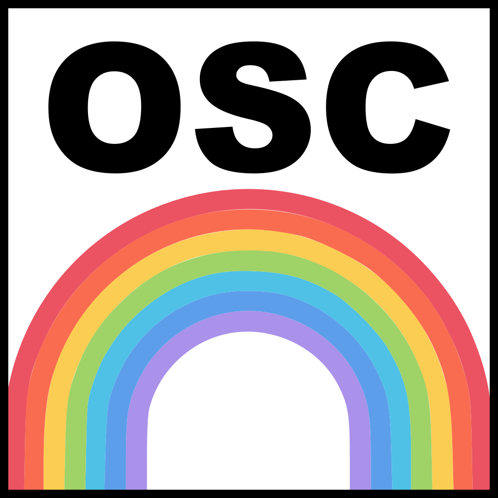

# OscBridge
A bridge between Serial SLIP, OSC UDP and OSC WebSocket made in Electron.

## Install dev and test
- `npm install` : Install and setup all packages.
- `npm start` : Run with a window.
- `npx electron . --headless` : Run headless.

## Generate icons
- [Electron-icon-maker](https://www.npmjs.com/package/electron-icon-maker) was used to convert the logo to the icons.

## Build
- `npm install --save-dev electron-builder`
- `npm run build` : Under Windows, I need to run as administrator.